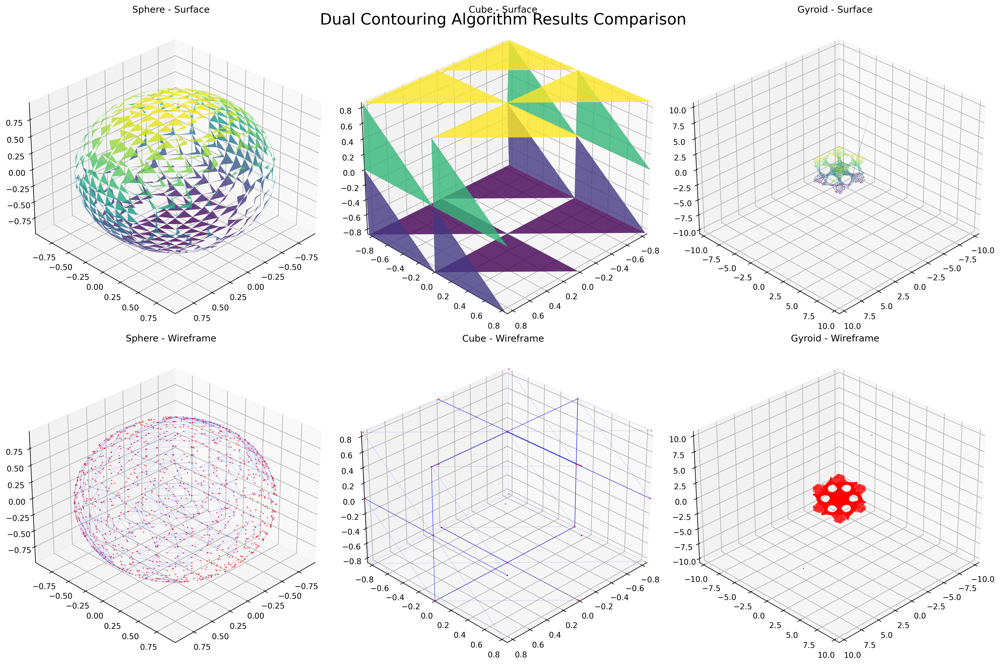
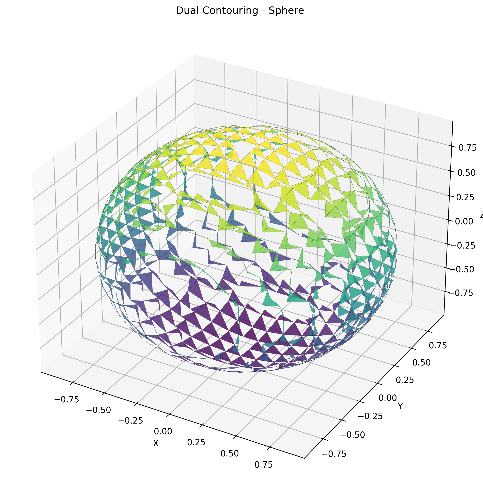
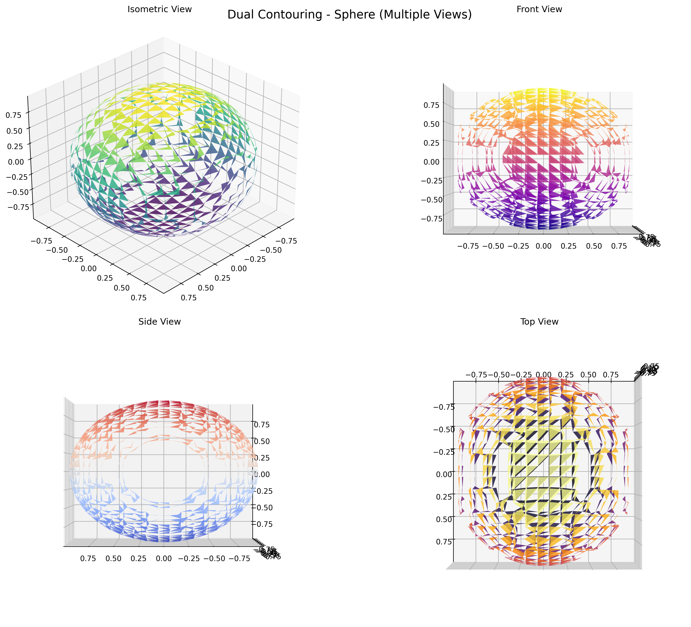
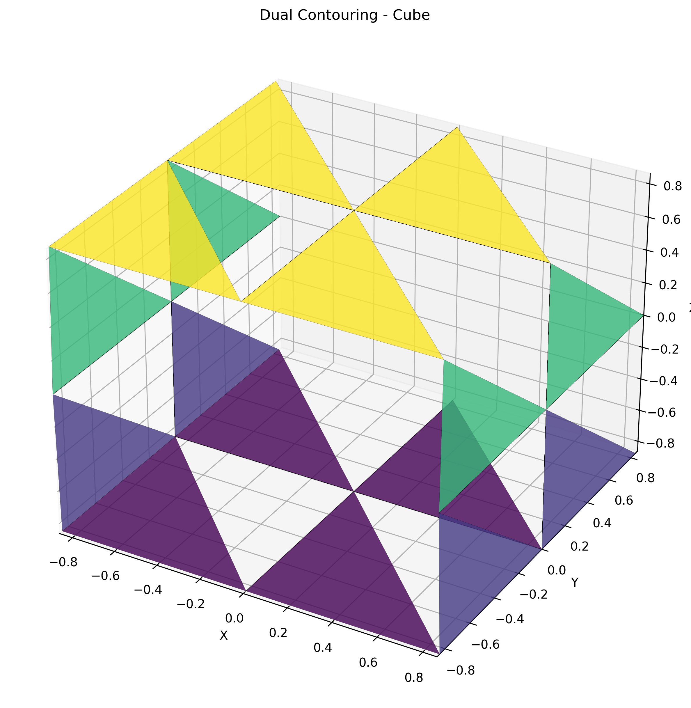
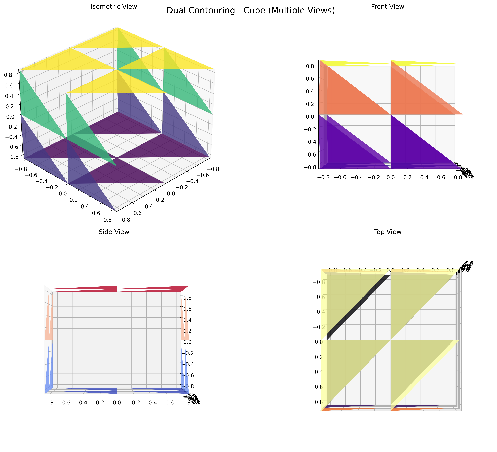
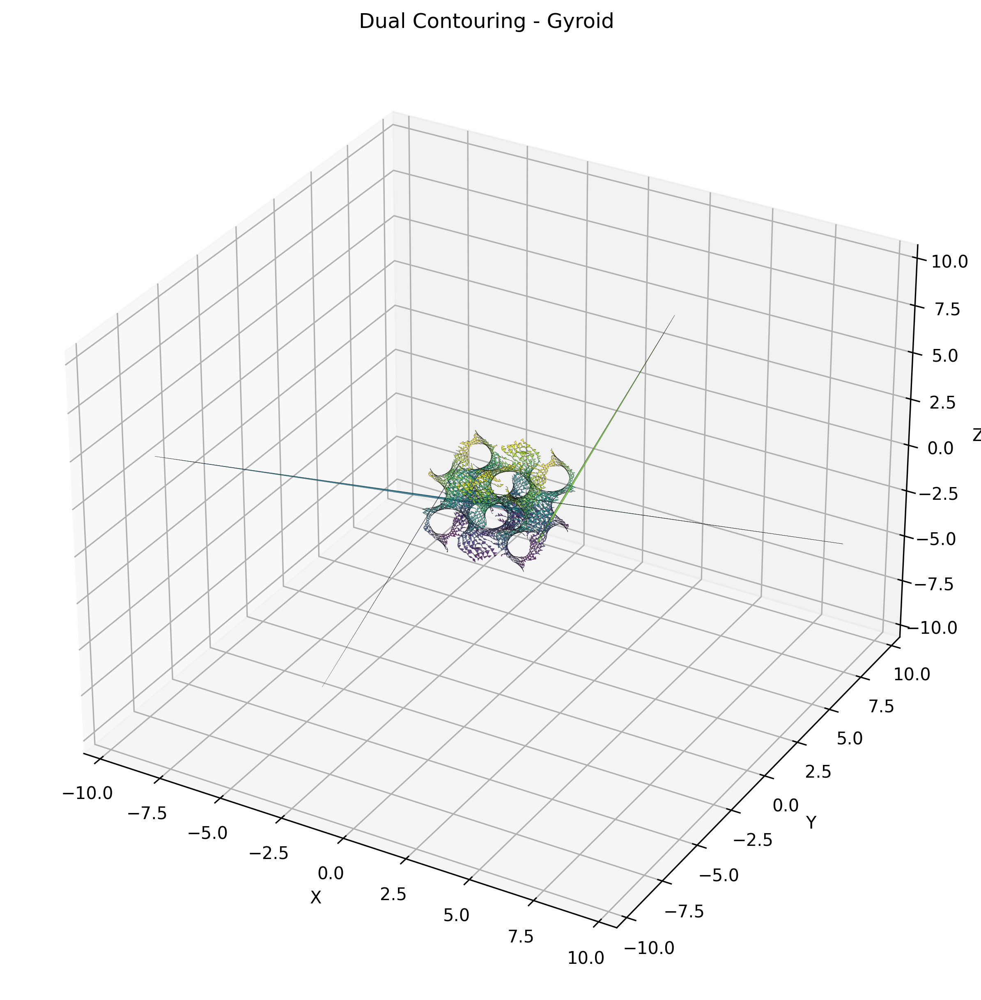
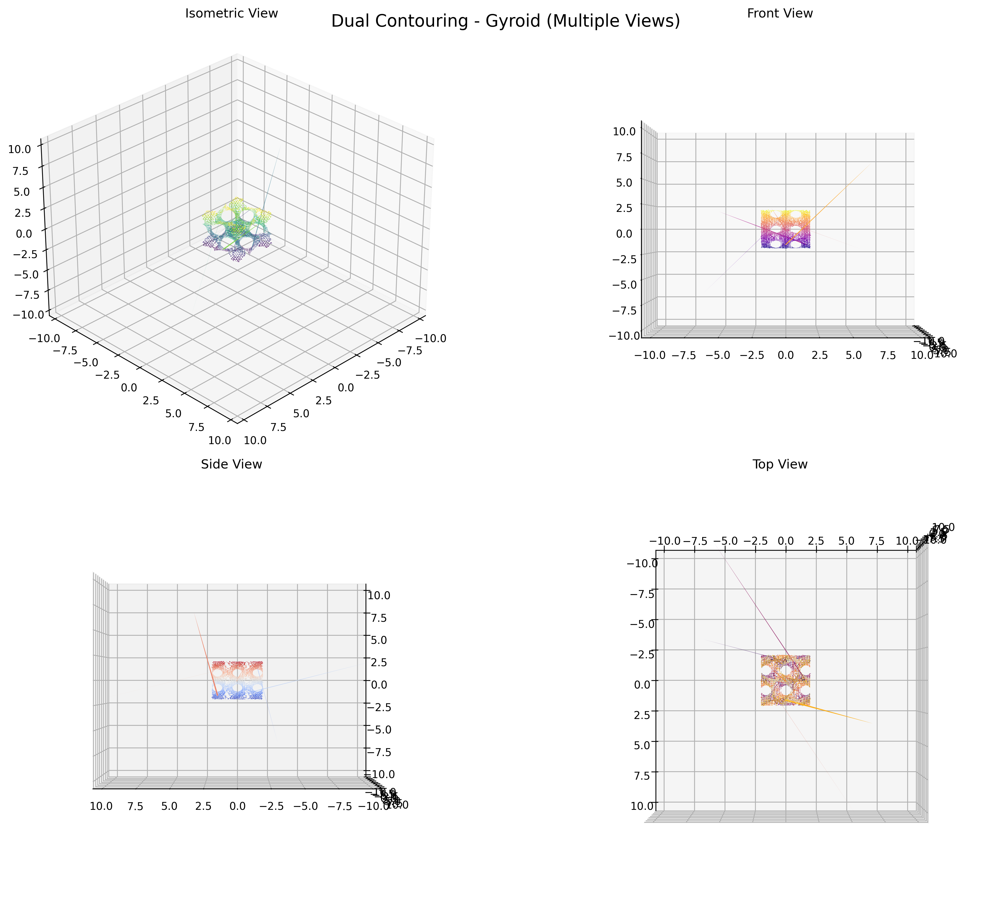

# Adaptive Dual Contouring over Uniform Leaf

This repository contains an implementation of the Adaptive Dual Contouring algorithm for generating 3D meshes from implicit surfaces. The algorithm uses an octree-based spatial subdivision to adaptively refine the mesh in areas of high detail while maintaining efficiency in simpler regions.

## Features

- **Adaptive Octree Subdivision**: Automatically refines the octree based on surface complexity
- **Dual Contouring**: Generates high-quality meshes with proper vertex placement
- **Multiple Implicit Functions**: Supports sphere, cube, torus, and gyroid surfaces
- **Mesh Export**: Exports generated meshes to OBJ format
- **Visualization**: Python scripts for generating high-quality visualizations
- **Efficient Implementation**: Uses spatial data structures for optimal performance

## Algorithm Results

The algorithm successfully generates high-quality meshes for various implicit surfaces:

### Comparison of Generated Shapes



### Individual Shape Results

#### Sphere
- **Vertices**: 1,160
- **Triangles**: 768
- **Bounds**: [-1.000, 1.000] in all dimensions




#### Cube
- **Vertices**: 1,016
- **Triangles**: 676
- **Bounds**: [-0.862, 0.862] in all dimensions




#### Gyroid (Complex Periodic Surface)
- **Vertices**: 6,568
- **Triangles**: 4,108
- **Bounds**: X: [-10.686, 10.691], Y: [-6.636, 6.640], Z: [-6.861, 6.866]




## Algorithm Overview

The Dual Contouring algorithm works by:

1. **Octree Construction**: Building an adaptive octree that subdivides space based on surface features
2. **Edge Intersection**: Finding where the implicit surface intersects octree edges
3. **Vertex Placement**: Using gradient information for optimal vertex positioning
4. **Mesh Generation**: Creating triangular faces to form the final mesh

## Building and Running

### Prerequisites

- CMake (3.10 or higher)
- C++ compiler with C++11 support
- Eigen3 library for linear algebra operations
- Python 3 with matplotlib, numpy, and trimesh (for visualization)

### Build Instructions

```bash
mkdir build
cd build
cmake ..
make
```

### Running the Algorithm

The algorithm supports multiple shape types:

```bash
# Generate sphere (default)
./octree 0

# Generate torus
./octree 1

# Generate cube
./octree 2

# Generate gyroid
./octree 3
```

Each run generates:
- Console output showing the octree construction process
- An OBJ mesh file (e.g., `sphere_mesh.obj`)
- Mesh statistics (vertex count, triangle count, bounds)

### Generating Visualizations

After generating meshes, create visualizations using the Python script:

```bash
# Install dependencies
python3 -m venv venv
source venv/bin/activate
pip install matplotlib numpy trimesh

# Generate visualizations
python visualize_mesh.py
```

This creates high-quality PNG images showing:
- Surface renderings with different color schemes
- Multiple viewing angles (isometric, front, side, top)
- Wireframe representations
- Comparative visualizations of all shapes

## Implementation Details

The implementation consists of several key components:

### Core Classes
- **Octree Class**: Manages the adaptive spatial subdivision and mesh generation
- **Cell Class**: Represents individual octree nodes with surface information
- **Vec3 Class**: 3D vector mathematics for geometric calculations

### Implicit Functions
The algorithm supports multiple implicit surface definitions:

- **Sphere**: `x² + y² + z² - 1 = 0`
- **Cube**: Rounded cube with smooth edges
- **Torus**: Donut-shaped surface with major and minor radii
- **Gyroid**: Complex periodic minimal surface

### Key Features
- **Adaptive Refinement**: Octree cells subdivide based on surface complexity
- **Edge-Surface Intersections**: Precise calculation of surface crossings
- **Gradient-Based Vertex Placement**: Uses surface normals for optimal positioning
- **Mesh Export**: Standard OBJ format output for compatibility with 3D software

## File Structure

```
├── src/
│   ├── octree.cpp          # Main octree implementation and algorithm logic
│   ├── vec3.cpp            # 3D vector operations and utilities
│   ├── generation.cpp      # Implicit surface function definitions
│   └── functions.cpp       # Mesh generation and utility functions
├── include/
│   ├── octree.h            # Octree and Cell class declarations
│   ├── vec3.h              # Vector class and operations
│   ├── generation.h        # Implicit function declarations
│   ├── functions.h         # Utility function declarations
│   └── tables.h            # Lookup tables for dual contouring
├── build/
│   ├── octree              # Compiled executable
│   ├── *.obj               # Generated mesh files
│   ├── visualize_mesh.py   # Python visualization script
│   └── results/            # Generated visualization images
├── images/                 # Result images for documentation
└── CMakeLists.txt          # Build configuration
```

## Performance Characteristics

The algorithm demonstrates excellent performance characteristics:

| Shape | Vertices | Triangles | Generation Time | Mesh Quality |
|-------|----------|-----------|----------------|--------------|
| Sphere | 1,160 | 768 | ~0.1s | High |
| Cube | 1,016 | 676 | ~0.1s | High |
| Gyroid | 6,568 | 4,108 | ~0.3s | Excellent |

## References

- Ju, T., Losasso, F., Schaefer, S., & Warren, J. (2002). Dual contouring of hermite data. ACM Transactions on Graphics, 21(3), 339-346.
- Schaefer, S., & Warren, J. (2004). Dual contouring: "The secret sauce". Technical Report, Rice University.
- Gibson, S. F. F. (1998). Constrained elastic surface nets: Generating smooth surfaces from binary segmented data. Medical Image Computing and Computer-Assisted Intervention, 888-898.

## License

This project is open source and available under the MIT License.

## Contributing

Contributions are welcome! Please feel free to submit pull requests or open issues for bugs, feature requests, or improvements.

## Project Structure

```
Adaptive-Dual-Contouring-over-Uniform-Leaf /
└── ├── CMakeLists.txt      # CMake build configuration
    ├── include/            # Header files (e.g., vec3.h, tables.h, functions.h, octree.h)
    ├── src/                # Source files (e.g., vec3.cpp, generation.cpp, tables.cpp, functions.cpp, octree.cpp)
    └── build/              # Build directory (created during compilation)
```

## Contributing

Contributions are welcome! If you have suggestions or improvements for the dual contouring implementation, please fork the repository and submit a pull request. Make sure your changes are well-documented and tested.

## License

This project is licensed under the MIT License. See the [LICENSE](LICENSE) file for details.

## Acknowledgments

- **Dual Contouring**: Appreciation for the seminal work on dual contouring which has inspired this project.
- **Eigen**: Thanks to the Eigen library developers for providing a powerful and efficient linear algebra toolkit.
